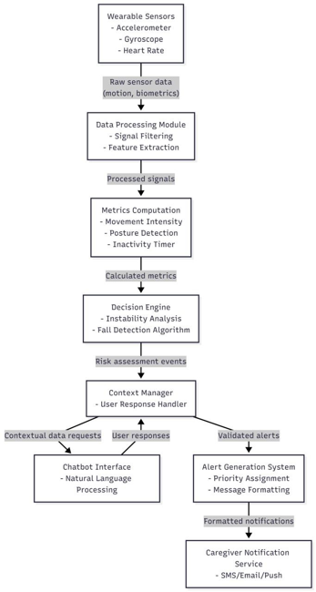
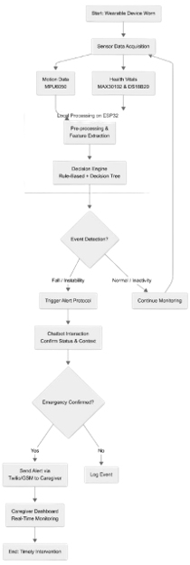

# SilverCare: Proactive AI Platform for Elderly Assistance, Health Monitoring & Caregiver Support

VOIS Innovation Marathon 2.0  

---

## ♦ Project Title
**SilverCare: Proactive AI Platform for Elderly Assistance, Health Monitoring & Caregiver Support**

---

## ♦ The Challenge

With the increasing elderly population, many senior citizens live alone without continuous supervision, leading to safety risks such as:

- Unnoticed Instability & Prolonged Inactivity – Gradual imbalance and abnormal movements go unnoticed. Early warning signs of health issues are missed.
- Medication Non-Adherence – Elderly individuals often forget to take medicines on time, leading to missed doses.
- Delayed Assistance – Senior citizens are unable to seek immediate help during emergencies.
- Frequent Falls – Leading cause of serious health complications.

Without an intelligent and reliable monitoring solution, senior citizens remain vulnerable to preventable injuries and delayed medical intervention.

---

## ♦ Problem Statement

To develop an automated, intelligent, and wearable monitoring system that ensures continuous health tracking, medication adherence, fall detection, and instant emergency alerts for elderly individuals.

---

## ♦ Need of the Project

Senior citizens living alone require continuous monitoring to reduce risks related to falls, missed medications, and delayed emergency response.

---

## ♦ Proposed Solution

SilverCare is an automated, intelligent, and wearable monitoring system consisting of:

- Wearable Waistband Device – Comfortable for continuous daily use.
- Multi-Sensor Monitoring – Tracks movement, posture, inactivity, and vital signs in real time.
- Smart Detection System – Processes sensor data to detect falls and abnormal behaviour with fewer false alerts.
- Medicine Reminder Feature – Sends timely alerts to ensure medicines are taken on schedule.
- Automatic Emergency Alerts – Notifies caregivers instantly via GSM or Twilio.

---

## ♦ Solution Overview

**What?**  
A wearable monitoring system for senior citizens to track health, activity, and safety.

**Why?**  
To reduce risks from falls, missed medications, and delayed emergency response.

**Who?**  
Elderly individuals living alone and their caregivers or family members.

**Where?**  
At home or during daily activities, without restricting movement.

**When?**  
Continuous monitoring, with instant alerts during emergencies.

**How?**  
Using a wearable waistband with multi-sensors, smart detection logic, medicine reminders, and automatic caregiver alerts.

---

## ♦ Technology Used

**Communication:**  
- Twilio API  
- GSM Module for alert delivery  

**Software Tools:**  
- Python  
- JavaScript  
- Arduino IDE  
- Serial Monitor  
- Firebase  

---

## ♦ Technical Flow Diagram

```markdown

```

---

## ♦ Workflow Diagram

```markdown

```
---

## ♦ Future Scope

- Advanced Health Sensors: Add improved physiological sensors for early detection.
- Better AI Models: Train with larger real-world data for higher accuracy.
- Emergency System Integration: Connect with emergency services for faster response.

---

## ♦ Repository Documents

- [backend/main.py](./backend/main.py)
- [backend/portal_server.py](./backend/portal_server.py)
- [Hackathon Problem Statement](./documents/hackathon_problemstatement.pdf)  
- [Project Presentation](./documents/projectpresentation.pptx)  

---

## ♦ GitHub Repository Link

https://github.com/Pujagithub2006/VOIS-and-Team-89

---

## ♦ How to Run the Project

1. Clone the repository  
2. Install required dependencies by pip install -r requirements.txt
3. Configure Twilio API / GSM module  
4. Run the backend file
   1) python backend/main.py
   2) python backend/portal_server.py
6. Upload code to Arduino using Arduino IDE  
7. Launch the web interface by opening web server for frontend/portal.html

---

Thank You
